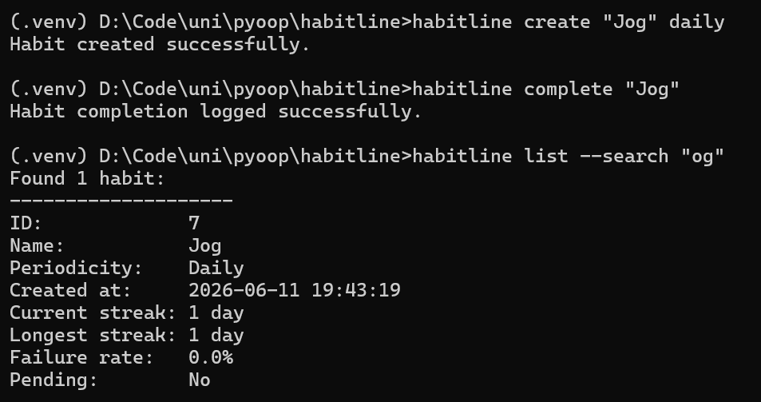
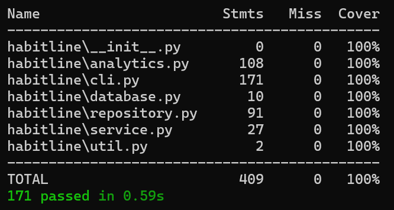

# HabitLine

## Context

The project is developed for a course at the [International University of Applied Sciences](https://www.iu.org/).

## Key Features

- Flexible command-line interface.
- Habit management and completion logging.
- Habit identification via either numeric ID or unique name.
- Analysis of habit completion statistics with possible restrictions to a specific time range. This affects
  the calculations of the streak (becomes "streak by the end of the range"), longest streak, and failure rate.
- Aggregate analysis of the habit collection.

## Technology Stack

- Click for CLI implementation.
- sqlite3 for database interactions.
- SQLite for persistence.
- pytest for testing.

## Typical Workflow Example

- Run `habitline create` to create a new habit with a given name and periodicity.
- Run `habitline complete` with the exact habit name in order to log a completion for the specified habit.
- Run `habitline list` to view your habits. Supports multiple filters, different sorting orders, and analytics time
  range restrictions.

Additional information on the provided features can be obtained by running any of the available commands, including the
root `habitline` command, with the `--help` flag.

## Running the Application

### As a Regular CLI Tool

- Have Python installed. Minimum version - 3.11.
- Clone the repository and navigate into its folder.
- Run `pip install -e .`.
- Start a new terminal session. The CLI tool should now be installed.
- Run `habitline` or `habitline --help` to print help about commands.

### As a Developer

- Have Python installed. Minimum version - 3.11.
- Clone the repository and navigate into its folder.
- Create a virtual environment and activate it via your method of choice. For example, run `python -m venv .venv` and
  `.venv/Scripts/activate`.
- Run `pip install -e .[dev]`. The CLI tool should now be installed with development-specific dependencies, particularly
  for testing.
- Run `habitline` or `habitline --help` to print help about commands.

## Testing the Application

### Automated Testing

Run `pytest` after installing the development version. This will run all test cases and a coverage report.

A coverage report may also be generated in a different format for more in-depth exploration. For example, run
`pytest --cov-report=html` to generate a browser-based report. This report can be viewed by opening the `index.html`
file from the newly generated `htmlcov` folder.

### Manual Testing

Run `habitline debug seed` to fill the database with fixtures for manual testing. This will clear any existing data and
fill the database with tracking data for 6 predefined habits over a course of 4 weeks. The data will be generated with
reference to the current date at the time of seeding - for example, the most recent completion of the habit "Journal"
will be on the date when the seeding command was run.

### Current Test Status

As of the latest application version, 100% coverage with unit tests is achieved and all tests
pass: 
